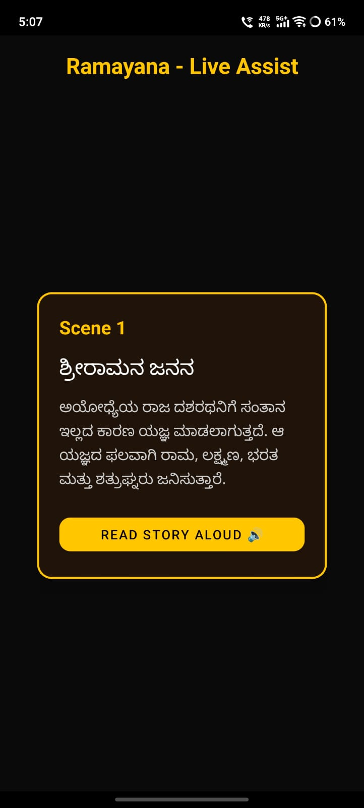
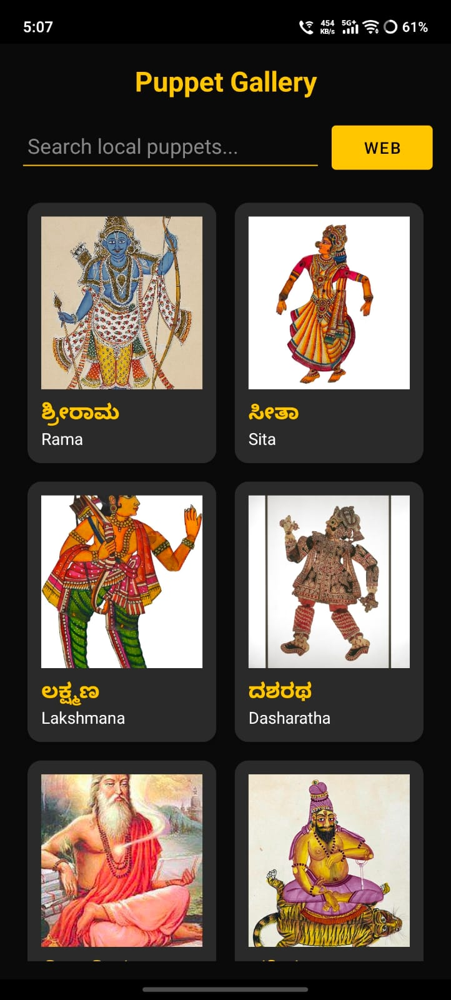
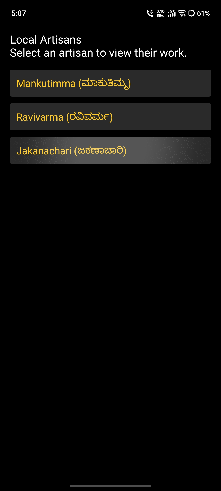

# Togalu-Gombe 🎭 : Digital Shadow-Theater Companion


**Togalu-Gombe** is a "Digital Shadow-Theater" companion app built to preserve and modernize Togalu Gombeyaata (Karnataka's traditional leather puppetry). Originally an oral tradition told in Old Kannada, this app bridges the generation gap by providing bilingual scene summaries, audio narrations, an interactive offline gallery, and direct connections to local artisans.

*Developed as part of the MindMatrix VTU Internship Program (State Pride).*

---

## ✨ Key Features

### 🔐 Smart User Onboarding
* **Cinematic UI:** Clean splash screen with fade-in animations.
* **Local Authentication:** Utilizes `SharedPreferences` to securely store user contact details for automated booking receipts.

### 📖 Live Assist: The Ramayana Epic
* **Comprehensive Breakdown:** 69-scene breakdown of the Ramayana in both Kannada and English.
* **Accessibility Native TTS (Text-To-Speech):** Users can tap "Read Aloud" to have the device narrate the English translations in real-time.
* **Smooth Navigation:** Swipeable UI built with `ViewPager2` and premium dark-leather themed cards.

### 🖼️ Interactive Puppet Gallery & Live Search
* **Offline-First Catalog:** 23 iconic characters powered by a local JSON database.
* **Live Text Filtering:** Instantly search through characters by Kannada or English names.
* **Infinite Web Expansion:** An integrated "WEB" button launches a native WebView mini-browser, automatically converting user queries into a formatted Google Image Search (e.g., "puppet image of Bheema").
* **Social Sharing:** Premium popup dialogs with direct Intents to share character lore to WhatsApp or SMS.

### 🤝 Artist Connect & Automated Bookings
* **Artisan Directory:** List of verified local artisans (e.g., Mankutimma, Ravivarma) with their catalog details.
* **Silent SMTP Background Emails:** Integrates the JavaMail API to act as a mini-mail server, automatically drafting and sending a silent email receipt to the user's registered email address upon booking.
* **Rich Notifications:** Triggers Android System Notifications with booking confirmation details.

### 🎥 History & Lore Feed
* **Curated Content:** List of documentaries and animated films to educate the younger generation.
* **Safe Playback:** Safely delegates video playback to the native YouTube app via `Action.VIEW` Intents to ensure crash-free, high-quality playback.

### 🎵 Thematic Audio Experience
* **Cultural Mood Setting:** Uses ExoPlayer to play a 5-second traditional instrumental track upon app launch to set the cultural mood without overwhelming the user.

---

## 🛠️ Tech Stack & Architecture

* **Language:** Kotlin
* **UI/UX:** XML (Material Design 3, ViewPager2, RecyclerView, CardView)
* **Architecture:** Offline-First (Local JSON Parsing with Gson)
* **Media:** ExoPlayer (Audio), `android.speech.tts` (Voice)
* **Networking/Web:** WebView, JavaMail API (SMTP Emailing)
* **Build System:** Gradle (Built entirely via CLI/VS Code without Android Studio dependency)

---

## 📱 Screenshots

| Splash & Login | Live Assist (TTS) | Gallery & Search | Artist Booking (Email) |
| :---: | :---: | :---: | :---: |
|  |  |  |  |


---

## 🚀 How to Run Locally

This project is highly optimized and can be built entirely from the command line (no heavy Android Studio required).

### Prerequisites
* JDK 17 or higher
* Android SDK (Target SDK 34)
* Gradle 8.5+

### Build Instructions

**1. Clone the repository:**
```bash
git clone [https://github.com/YourUsername/Togalu-Gombe.git](https://github.com/YourUsername/Togalu-Gombe.git)
cd Togalu-Gombe
```

**2. Build the APK via terminal:**
```bash
./gradlew assembleDebug
```

**3. Connect your Android device via USB (Debugging Enabled) and install:**
```bash
./gradlew installDebug
```

## 📁 Project Structure Highlights

* assets/puppets.json: The core offline database powering the app's lore.

* res/drawable/: Contains optimized, offline imagery to prevent broken links from strict hotlink-protected servers.

* res/values/themes.xml: Enforces a strict, immersive "Dark Theater" aesthetic globally.

## 🤝 Acknowledgments

* MindMatrix & VTU for the internship problem statement and guidance.

* The local artisans of Nimmalakunta and Karnataka for keeping the Togalu Gombeyaata art form alive.
